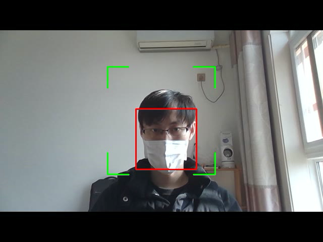
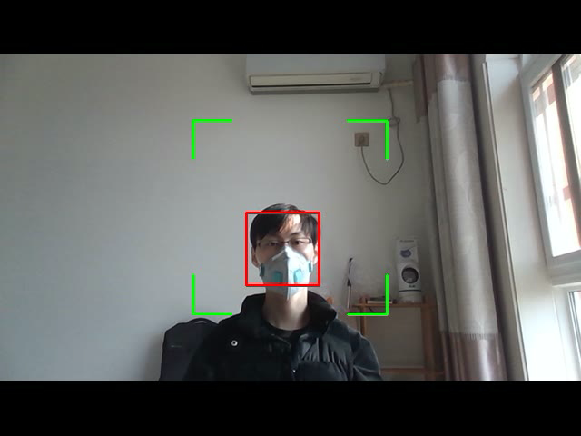
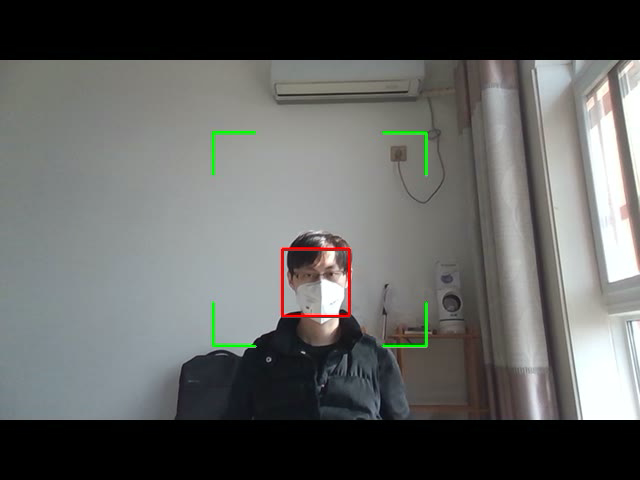

# FaceDetection-WearMask
一个用以检测戴口罩人脸的工程，基于MXNet、OpenCV开源框架，使用C++语言实现。

样例视频：data/result/demo_mask1.avi,data/result/demo_mask2.avi,data/result/demo_mask3.avi

样例图片：
data/result/demo_mask1.png

data/result/demo_mask2.png

data/result/demo_mask3.png
